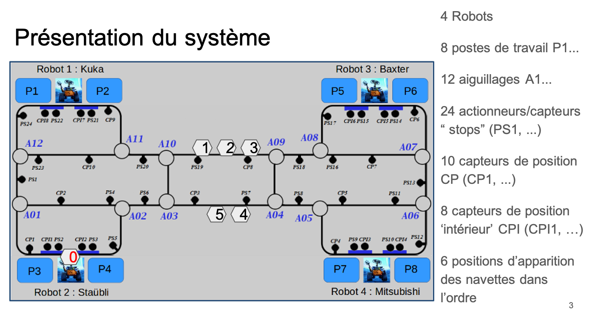
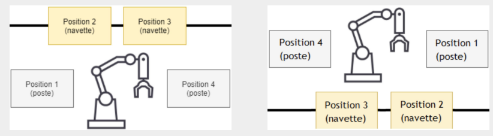

# Package commande_locale

## 1. Description générale
Le but de ce package est de faire l'intermédiaire entre la simulation physique (CoppeliaSim), le réseau de Pétri haut niveau complété par les étudiants et l'utilisateur.
Ainsi, il gère le cycle de vie de la simulation, traduit les signaux venant des capteurs et actionneurs et enregistre l'historique de production.
C'est notamment ce programme qui ouvre CoppeliaSim et charge la scène voulue dedans.

## 2. Composition
Ce dossier est composé de 5 éléments:
* Un fichier package.xml, définissant les métadonnées et dépendances du paquet (rclcpp, std_msgs, opencv, etc.).
* Un fichier CMakeLists.txt, configuré pour ROS 2 (Jazzy), gérant la compilation et la génération des interfaces.
* Un dossier msg, permettant de définir des structures de messages pour communiquer
* Un dossier srv, permettant de définir des structures de services pour communiquer
* Un dossier src, où se trouve le code source C++ et composé des fichiers suivants :
  * commande_locale.cpp, qui initialise les fonctions, s'assure que Coppelia répond bien et affiche le menu
  * inOutController.cpp et inOutController.h, qui s'occupe de convertir les données des capteurs et des actionneurs entre CoppeliaSim et le réseau de Pétri
  * vrepController.cpp et vrepController.h, qui contient les opérations élémentaires pour faire fonctionner la simulation
  * display.cpp, qui ouvre une fenêtre OpenCV pour voir la simulation sous un autre point de vue
  * LogManager.cpp, qui permet de garder sur un fichier texte l'historique

Nous avons trois exécutables différents pour ce dossier : "simulation" qui lance les fichiers commandelocale.cpp, inOutController.cpp et vrepController.cpp; "display_node" qui lance le fichier display.cpp; log_manager qui lance le fichier LogManager.cpp.
Nous noterons que pour la simulation étudiante le code display.cpp n'est pas exécuté, et est donc inutile à son fonctionnement.


## 3. Description détaillée des fichiers src
### 3.1. Fichier commande_locale.cpp
La fonction main est le code principal du package. Elle fait dans l'ordre :
* Initialisation de ROS2
* Création d'un noeud commande_locale
* Abonnemment en publisher ou suscriber aux topics
* Récupération de la scène CoppeliaSim voulue
* Initialisation des codes vrepController et inoutController
* Boucle d'attente de la fin du démarrage de Coppelia
* Exécution d'un fichier launch général
* Boucle d'attente de la fin de l'initialisation
* Si le programme n'est pas en mode autorun (ce qui est le cas en lançant normalement la simulation depuis le dossier etu) :
  * Affiche le menu de choix (Ajouter un produit/ Pause/ Play/ Fin programme)
  * En fonction des cas, retourne soit une erreur soit execute le programme associé
* Si le programme est en mode autorun :
  * Lance automatiquement la simulation
  * Attend la fin du réseau de Pétri
  
Ce fichier est également composé de fonctions simples, appelées par des pulications sur des topics, chargées par exemple de mettre des variables à une certaine valeur ou par exemple de fermer le programme.


### 3.2. Fichiers inOutController.cpp et inOutController.h
Ces fichiers sont composés de plusieurs fonctions. 

Nous avons premièrement les fonctions *SensorCallbackRail*, *SensorCallbackStop* et *SensorCallbackSwitch* pour les capteurs. Nous récupérons de CoppeliaSim tous les états des capteurs sur un entier, et le but de ces programmes est alors de traduire ce code en binaire, pour indiquer au réseau de Pétri un par un l'état de chaque capteur.

Nous avons de même les fonctions *StateSwitchCallBack*, *StateStopCallBack* et *StatePinCallBack* pour les actionneurs. Ces fonctions font exactement l'inverse : elles reçoivent du dossier commande (RdP) un message binaire, qu'elles traduisent en un entier.

La fonction *SensorCallbackRail* gère les 10 capteurs de position CP. La fonction *StatePinCallBack* gère les 8 capteurs de position intérieurs CPI.
La fonction *SensorCallbackRail* gère les 24 capteurs "stops" PS. La fonction *StateStopCallBack* gère les mises en route ou les arrêts des 24 segments de la simulation.
Les fonctions *SensorCallbackRail* et *StateSwitchCallBack* gèrent les 12 aiguillages (droite, gauche, lock).

Les capteurs et actionneurs sont représentés sur la figure ci-dessous :


Enfin, nous avons la fonction init, qui s'abonne en publisher ou en suscriber aux topics concernant les capteurs et les actionneurs, et qui initialise les capteurs intérieurs CPI.


### 3.3. Fichiers vrepController.cpp et vrepController.h
Ces fichiers contiennent des fonctions appelées depuis commande_locale.cpp. Les principales sont : 
* *pause*, qui bloque la simulation jusqu'à ce que l'utilisateur demande de la redémarrer.
* *play*, qui lance la simulation jusqu'à ce que l'utilisateur demande une pause
* *loadModelInit*, qui traduit le numéro de la navette en lettre, et ouvre le fichier correspondant à la navette directement dans Coppelia. Ces fichiers sont sous la forme "ShuttleA" (d'où la traduction en lettre) et contiennent des informations sur les navettes, comme leurs coordonnées de départ.
* *close*, qui kill tous les noeuds et les topics, quand l'utilisateur choisit dans le menu Fin Programme
* *init*, qui trouve le chemin vers CoppeliaSim et qui le lance. On s'abonne ici encore aux topics qu'on écoute ou sur lesquels on publie.
* *computeTableId*, qui traduit le numéro de poste en identifiant CopeliaSim
* *addProduct*, qui fait apparaitre un produit sur un poste donné lorssqu'il rentre en production
* *computeNumRobotPosteTache*, qui traduit le numéro de poste en terme de robot ("tab[0]" correspond au robot associé au poste (1 robot pour 2 postes) et "tab[1]" correspond à la position du poste par rapport au robot). L'illustration pour tab[1] est représentée sur l'image ci-dessous :



### 3.4. Fichier display.cpp
Ce fichier contient des commandes pour ouvrir une fenêtre OpenCV, par les fonctions suivantes :
* *update*, qui rafraichit l'image à l'écran
* *getSimuStream*, qui traduit les images ROS en matrice pour OpenCV
* *main*, qui initialise OpenCV et crée une fenêtre où elle le lance. Elle s'abonne également à des topics et lance en boucle la fonction *update*.

Ce fichier n'est pas pris en compte dans la simulation étudiante, car le fichier launch principal ne le lance pas.


### 3.5. Fichier LogManager.cpp
Ce fichier est composé des fonctions :
* *main*, qui efface l'ancien fichier texte log.txt, pour en créer un nouveau, sur lequel seront écrit les actions importantes de la simulation.
* *ProduitEvacCallback*, qui écrit dans le fichier texte lorsqu'un produit est évacué
* *NewProductCallback*, qui écrit dans le fichier texte lorsqu'un nouveau produit apparait dans la simulation
* *ErreurCallback*, qui écrit dans le fichier texte et dans la console lorsqu'une erreur se produit. Elle écrit un message spécifique en fonction de l'erreur rencontrée (chaque type d'erreur à un code)
* *TachefinieCallback*, qui écrit dans le fichier texte à chaque tâche finie
* *PetriTermineCallback*, qui écrit dans le fichier texte que le Pétri est terminé

Les fonctions de ce fichier sont activées lors de publications sur des topics spécifiques lors d'actions effectuées par le code.


### 3.6. Sécurités mises en place
Des sécurités ont été ajoutées pour permettre de repérer convenablement certains problèmes.

Dans le fichier commande_locale, il y a tout d'abord des erreurs affichées si jamais l'utilisateur entre autre chose que les solutions proposées. On affiche alors "Erreur mauvais choix".

Dans le fichier vrepController, nous affichons une erreur dans le cas où CoppeliaSim n'est pas trouvé dans les dossiers ("ERREUR : CoppeliaSim non trouvé"). Egalement, si le numéro de navette (shutlle) n'est pas bon (doit être compris entre 0 et 6), nous affichons "ATTENTION, LE NUMERO DU SHUTTLE DOIT ETRE COMPRIS ENTRE 0 ET 6". Enfin, dans la fonction addProduct, on demande à la fonction GetColor de nous dire la couleur de la pièce sur la table. S'il renvoit autre chose que 0 (autre chose que transparent), alors c'est qu'un objet est déjà présent sur la table et dans ce cas-là, on affiche alors "ERREUR : On ecrase un produit !!".
Dans le fichier LogManager, nous avons une fonction qui permet d'afficher des erreurs lorsque celles-ci surviennent. Nous pouvons donc afficher "ERREUR poste Vide", "ERREUR Operation sur un produit plein", "ERREUR Manipulation produit en traitement", "ERREUR Perte navette" et "ERREUR On a ecrase un produit".


## 4. Utilisation
Pour lancer le code depuis le répertoire ros, on fait d'abord :
```bash
  source /opt/ros/jazzy/setup.bash
  colcon build
  source install/setup.bash
```

Ensuite, on exécute la ligne suivante, qui permet de lancer les fichiers commande_locale, inOutController et vrepController :
```bash
  ros2 run commande_locale simulation 4
```
L'avant dernier mot ("simulation") correspond au nom de l'exécutable. Le dernier chiffre correspond au numéro de la scène. Nous avons deux scènes différentes : Simulation2Robots et Simulation4Robots. Nous ouvrons la scène Simulation2Robots en mettant le chiffre 2 et Simulation4Robots en mettant le chiffre 4. La Simulation2Robots est donc ouverte par la commande :
```bash
  ros2 run commande_locale simulation 2
```
Ces lignes permettent alors le lancement de Coppelia et le chargement de la scène. Si les autres packages sont également là, nous aurons l'ouverture de 6 pop up, menant au démarrage complet de la simulation. Après avoir rentré le nombre de navettes, nous aurons un affichage du menu dans la console.

Pour lancer le fichier display, il faut faire :
```bash
  ros2 run commande_locale display_node
```

Pour lancer le fichier LogManager, il faut faire :
```bash
  ros2 run commande_locale log_manager
```

## 5. Protocole de Test
Il a fallu, pour la migration du code de ROS1 à ROS2, tester unitairement ce package. Pour cela, un protocole de test a été établi,  pour sortir de l'initialisation et afficher le menu, à retrouver dans le fichier "tests_du_package_commande_locale". 

Dans ce protocole, nous envoyons les messages sur les topics associés à la place de CoppeliaSim. Ce protocole n'est donc valable que **si CoppeliaSim n'est pas opérationnel** (n'envoit pas les messages correctement sur les topics).
