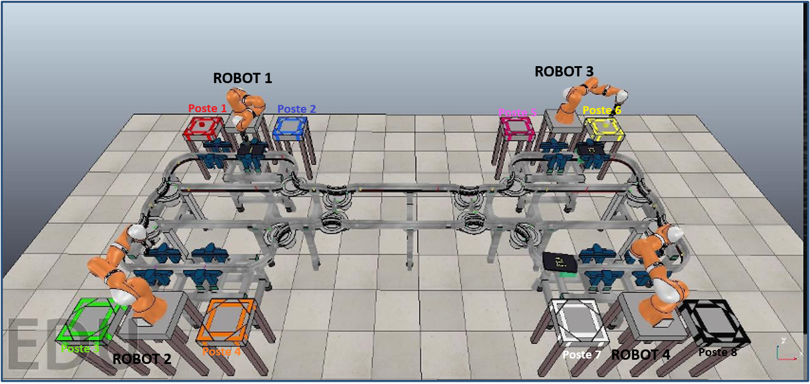

# ReadMe du Package Robots

## 1. Description générale
Le but de ce package est de gérer la logique et le contrôle des bras robotiques de la simulation. 
Chaque bras robotique constitue un noeud et donc fait tourner le programme indépendamment. Pour les 4 bras, nous avons donc 4 exécutions du même programme en parallèle. Nous avons en tout 4 bras robotiques sur cette simulation, soit 8 postes (un bras pour deux postes). Ils sont répartis de la manière suivante :




## 2. Composition
Ce dossier est composé de 5 éléments:
* Un fichier package.xml
* Un fichier CMakeLists.txt
* Un dossier msg, permettant de définir des structures de messages pour communiquer
* Un dossier src, où se trouve le code source C++ et composé des fichiers suivants :
  * main_robot.cpp, qui initialise le robot
  * Robot.cpp et Robot.h, qui définissent toutes les fonctions pour le mouvement du bras robotique
  * Poste.cpp et Poste.h, qui représentent un poste de travail et contient les données associées
* Un dossier launch, pour lancer plusieurs robots à la fois

## 3. Description détaillée des fichiers src
### 3.1. Fichier main_robot.cpp
La fonction main est le code principal du package. Elle fait dans l'ordre :
* Initialisation de ROS2
* Récupération du numéro du robot
* Création d'un objet Robot
* Lancement d'un thread pour écouter les messages ROS2 en arrière plan, sans rester bloquer dans le reste du programme
* Boucle une mise à jour du programme pour rafraichir l'état des tâches en cours
* Ecoute du topic shutdown, pour kill le noeud si l'utilisateur le demande

### 3.2. Fichiers Robot.cpp et Robot.h
#### 3.2.1. Détails des fonctions utilisées
Ces fichiers sont composés de nombreuses fonctions, dans l'ordre :
* Le constructeur *Robot*, qui initialise la valeur de certaines variables
* La fonction *EnvoyerRobot*, qui peut envoyer le robot dans 4 positions différentes prédéfinies en envoyant à chaque morceau du bras robotique l'angle à avoir. On demande à chaque tour à CoppeliaSim les coordonnées de chaque morceau de bras, et on valide la position globale quand elle est atteinte à 0.001 radian de la position cible pour tous les morceaux.
* La fonction *EnvoyerJoints*, qui peut envoyer le robot dans une position rentrée par l'utilisateur (doit rentrer les coordonnées de chaque morceau du bras robotique). Comme pour la fonction *EnvoyerRobot*, on demande un feedback à CoppeliaSim et on se satisfait d'une position à 0.001 près.
* Les fonctions *DescendreBras* et *MonterBras*, qui modifient les coordonnées de chaque morceau de bras robotique pour le faire descendre ou monter. Comme pour la fonction *EnvoyerRobot*, on demande un feedback à CoppeliaSim et on se satisfait d'une position à 0.001 près.
* Les fonctions *FermerPince* et *OuvrirPince*, qui donne un certain temps à la pince pour se fermer ou s'ouvrir
* Des fonctions de Callback, comme *SendPositionCallback* pour s'assurer que le robot à bien atteint la position demandée. Nous avons ainsi *SendJointsCallback*, *FermerPinceCallback*, *OuvrirPinceCallback*, *DescendreBrasCallback*, *MonterBrasCallback*
* La fonction *ControlerRobotCallback*, qui permet, à partir d'un message mis en entrée indiquant la position voulue, l'état de la pince et le mouvement que l'on veut faire faire au bras, de le faire bouger comme on souhaite
* La fonction *computeTableId*, qui fait l'intermédiaire entre CoppeliaSim et le réseau de Pétri. Elle permet à partir du numéro d'un robot et de sa position de savoir sur quel poste ce bras robotique est. Par exemple, pour le robot 1, en position 1, il est sur le poste 1 et en position 4, il travaille sur le poste 2.
* La fonction *Colorer*, qui permet l'animation des couleurs lors de la prise ou la dépose d'un objet. Une variable type nous indique si le but est de prendre l'objet (type=0) ou de poser l'objet (type=1). Dans le premier cas, on sauvegarde d'abord la couleur du produit présent, puis on rend ce produit invisible. On appelle ensuite la fonction *transport*, qui fera l'animation de la prise par la pince avec un cube gris. Si type=1, on appelera d'abord la fonction *transport*, puis on fera réapparaitre l'objet grâce à la couleur stockée en mémoire. Plusieurs sécurités sont mises en place au cours de cette fonction.
* La fonction *colorerPosteDebutTask*, qui permet de colorer un produit quand il est en cours de fabrication. En effet, pendant la phase de fabrication d'un produit, celui-ci sera représenté aec une opacité de 50%.
* La fonction *colorerPosteFinTask*, qui permet de colorer un produit quand il est fini. Une fois la fabrication terminée, nous gardons la même couleur mais passons à une opacité de 100%.
* La fonction *faireTacheCallback*, qui est déclenchée quand le noeud reçoit l'ordre de faire une tâche. Elle rend alors la pièce transparente, puis démarre un chronomètre pour vérifier que la tâche est faite dans un temps maximum imparti.
* La fonction *update*, appelée toutes les secondes par le programme principal. Elle regarde si une tâche est en cours, puis met à jour le temps restant pour faire cette tâche et l'affiche. Quand le temps devient égal à 0, la tâche est déclarée finie. On colore alors correctement le cube correspondant à la tâche et on prévient que la tâche est finie, pour passer à l'étape suivante.
* La fonction *transport*, qui gère l'affichage du cube lors des déplacements. Elle renvoit un booléen, qui vaut faux si le cube grisé (celui qu'on montre pendant les déplacements) doit être invisible et vrai s'il doit être visible.
* La fonction *Evacuer*, qui permet de faire disparaitre un produit lorsque celui-ci est fini. Elle rend alors le produit invisible.
* La fonction *stopTacheCallback*, qui permet d'interrompre une tâche en cas de problème. Elle publie un message sur un topic assigné pour prévenir du problème.
* La fonction *DeplacerPieceCallback*, qui combine plusieurs des fonctions vues précédemment pour déplacer une pièce d'un point A à un point B. Cette fonction envoie le robot dans une position donnée, fais descendre le bras, ferme la pince, remonte le bras, déplace le bras à la position B, descend le bras, ouvre la pince et remonte le bras, tout en respectant les codes couleur.
* La fonction *init*, qui associe le robot à 2 postes de travail (un à sa gauche et un à sa droite). Elle récupère également les identifiants des 7 moteurs du bras robotique. Enfin, elle définit des abonnements en souscription ou en publications à certains topics.

Ces fonctions sont appelées soit par l'intermédiaire de messages publiés sur certains topics, soit par l'intermédiaire du fichier main_robot (appelle le constructeur, la fonction init et la fonction update).


#### 3.2.2. Sécurités mises en place
Pendant l'exécution, il est possible de s'assurer du bon fonctionnement de la simulation grâce à des messages informatifs et des messages d'erreurs. Les différentes erreurs traitées sont :
* "Erreur lors de l'appel du service". Cela se produit lors de la fonction *Colorer*. Le robot demande l'identifiant de la navette, et si personne ne lui répond, alors il affiche cette erreur et annule l'action.
* "Pas de navette à la position demandée" (fonction *Colorer*). Le programme interroge le service ShuttleManager pour savoir quelle navette est devant lui. Si ce service renvoit la valeur 66 (identifiant vide), cela signifie qu'il n'y a pas de navettes là où il devrait y en avoir une.
* "Manipulation d'une piece en cours de traitement !" (fonction *Colorer*). Cela se produit lorsque le robot essaye d'efffectuer une action sur un produit, mais que le chronomètre de fabrication n'est pas encore terminé.
* "ON A ÉCRASÉ UN PRODUIT !!!" (fonction *Colorer*). Cela se produit lorsqu'on essaye soit de faire apparaitre un nouveau produit soit de déplacer un produit sur un poste où il y a déjà une tâche en cours.
* "TACHE SUR AUCUN PRODUIT !!!" (fonction *colorerPosteDebutTask*). Cela se produit lorsque le robot reçoit l'ordre de colorer un produit mais qu'il n'y a aucun produit en cours.
* "PRODUIT PLEIN !!!" (fonction *colorerPosteDebutTask*). Cela se produit lorsque le robot reçoit l'ordre de colorer un produit, mais que les 6 cubes maximum sont déjà pris (pas de possibilité d'avoir plus que 6 tâches par produit).
* "ERREUR : Nouvelle tache pendant une tache en cours !" (fonction *faireTacheCallback*). Cela se produit lorsqu'on envoit l'ordre à un robot de faire une tâche alors qu'il y a déjà une tâche en cours.
* "ColorerPosteTask Probleme !!" (fonction *update*). Cela se produit lorsque l'appel à la fonction colorerPosteFinTask renvoit une erreur. Cela signifie que le produit n'a pas été coloré correctement à la fin de la tâche.


### 3.3. Fichiers Poste.cpp et Poste.h
Ces fichiers servent de ressource aux fichiers Robot. Les fonctions contenues dedans servent à garder des informations en mémoire et à les retourner en cas d'appel par une autre fonction. Par exemple, on peut ainsi obtenir le nom du poste, la couleur, le numéro du poste, la durée et la tâche en cours. Les autres fonctions sont :
* *debutTask*, appelée lorsqu'une tâche démarre. Elle se charge de mettre à jour des variables communes.
* *updateTask*, appelée pour mettre à jour le temps restant pour une tâche, et qui renvoit true lorsque la tâche est terminée.
* *stopTask*, qui met la tâche en cours à false.

Les fonctions de ces fichiers sont appelées directement depuis le fichier Robot. Tous les postes sont instanciés dès le début, lors du passage dans la fonction init de Robot.


## 4. Utilisation
Il y a deux manières différentes de lancer le code. Il faut préalablement avoir fait les commandes suivantes dans le ros_ws :
```bash
  source /opt/ros/jazzy/setup.bash
  colcon build
  source install/setup.bash
```

* Par un lancement individuel
Exécuter la ligne suivante permet de lancer un robot :
```bash
  ros2 run robots robot 1
```
Le dernier chiffre correspond au numéro du robot que nous lançons. Ici nous initialisation donc le robot 1. L'avant dernier mot ("robot") correspond au nom de l'exécutable.

* Par un lancement couplé
Exécuter la ligne suivante permet de lancer 2 robots simultanément via un fichier launch : 
```bash
  ros2 launch robots robotsGauche.launch.py
```
Ce code permet de lancer les deux robots à gauche, soit les robots 1 et 2.

Pour lancer les deux robots de droite (3 et 4), il suffit de faire :
```bash
  ros2 launch robots robotsDroite.launch.py
```

## 5. Protocole de Test
Nous avons dû, pour notre migration, tester ce package indépendamment de CoppeliaSim. Pour cela, nous avons établi un protocole de test pour la fonction Evacuer, ainsi que pour le shutdown, en reprenant les commandes à faire depuis le début. Ce test se trouve dans le fichier "Tests du package robots".
Dans ce protocole, nous envoyons les messages sur les topics associés à la place de CoppeliaSim. Ce protocole n'est donc valable que **si CoppeliaSim n'est pas opérationnel** (n'envoit pas les messages correctement sur les topics).
